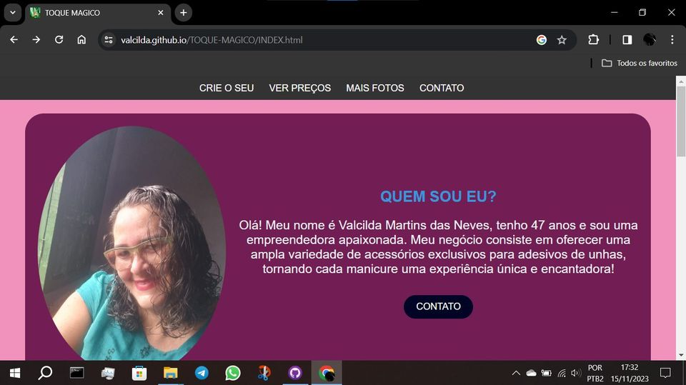
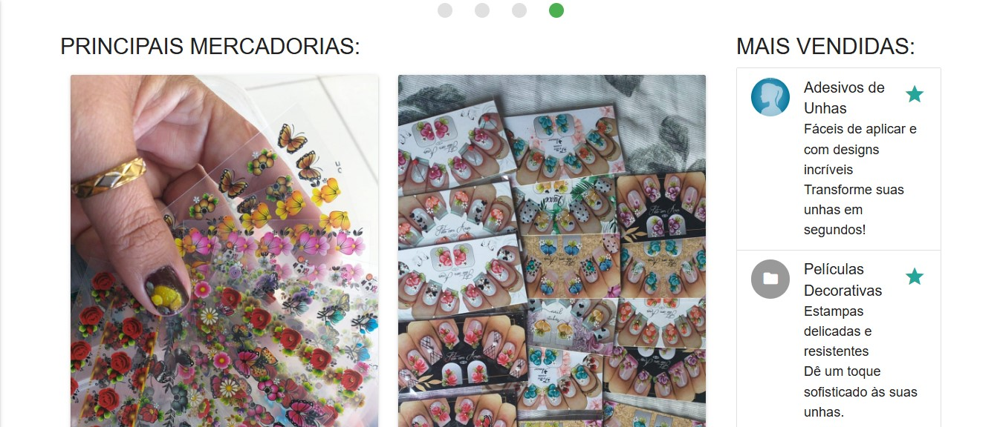
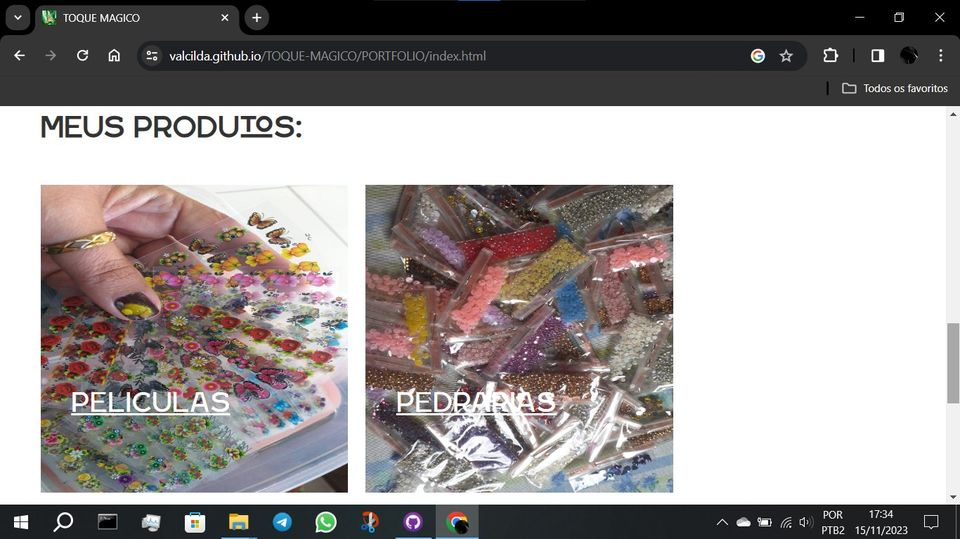
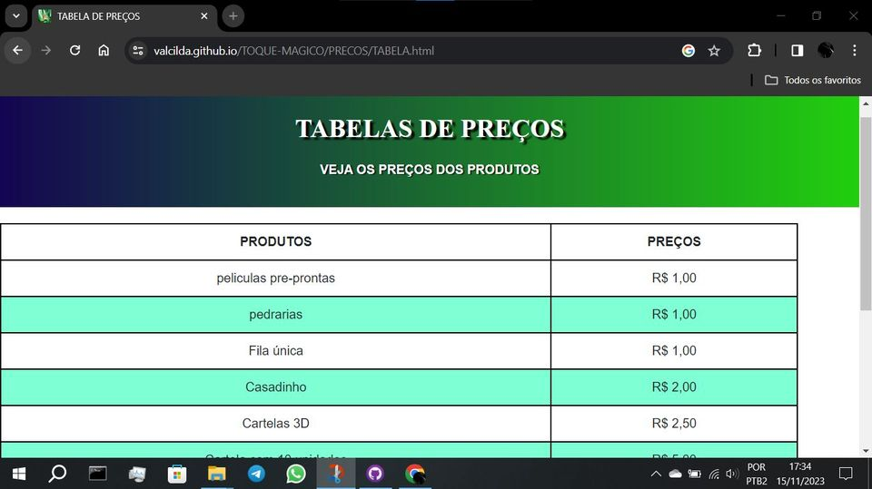

# SITE TOQUE MAGICO
👨‍⚖️TOQUE MAGICO É UM SITE QUE RODA NO GITHUB PAGES.

  
  
  
  

## DESCRIÇÃO:
O site "TOQUE MÁGICO" é a plataforma de apresentação e vendas dos produtos de Valcilda Martins das Neves, uma empreendedora especializada em acessórios exclusivos para adesivos de unhas. O site é estruturado da seguinte maneira:

1. **Menu de Navegação (Header)**: O menu no topo oferece fácil acesso a seções importantes, como "Localização", "Preços" e "Sobre", tanto para desktop quanto para dispositivos móveis. O layout é responsivo, adaptando-se bem a diferentes tamanhos de tela.

2. **Galeria de Slides**: Uma página dedicada a uma galeria com as melhores fotos dos produtos, utilizando o framework Materialize para garantir um layout visualmente atraente e responsivo.

3. **Página de Produtos (Portfólio)**: Apresenta os principais produtos de Valcilda, como películas, adesivos e pedrarias. Cada produto é acompanhado de uma descrição detalhada, preço e links diretos para compra via WhatsApp, permitindo uma navegação intuitiva.

4. **Página de Localização**: Inclui as informações sobre o endereço da empresa com um link direto para o Google Maps, facilitando a localização física para clientes que desejam visitar o local.

5. **Página de Preços**: As tabelas de preços foram movidas para uma seção dedicada, agora de fácil visualização e completamente responsiva, melhorando a experiência do usuário em dispositivos móveis.

6. **Sobre a Empreendedora**: Há uma seção dedicada a Valcilda Martins das Neves, contando sobre sua história, sua paixão pela arte dos adesivos de unhas e a experiência única que ela oferece aos seus clientes.

O design do site é altamente responsivo, com um layout limpo e visualmente atraente. As imagens de alta qualidade dos produtos ajudam a destacar a beleza dos acessórios, enquanto os botões de chamada para ação (como "COMPRAR") tornam o processo de compra direto e fácil para os clientes.

Além disso, o site inclui links para redes sociais, como Instagram, Facebook e WhatsApp, permitindo que os clientes se conectem diretamente com Valcilda para fazer perguntas ou realizar compras.

## MAIS:
* [CLIQUE AQUI PARA ACESSAR AO SITE](https://valcilda.github.io/TOQUE-MAGICO/index.html)
* [CLIQUE AQUI PARA ACESSAR AO REPOSITÓRIO](https://github.com/valcilda/TOQUE-MAGICO)
* [SITE CRIADO PELO VILHALVA](https://github.com/VILHALVA)
* [CRIE O SEU SITE](https://vilhalva.github.io/STYLER/03_HOME/FREELANCER/index.html)
* [VEJA O HISTÓRICO DE ATUALIZAÇÕES](./UPDATES.md)
