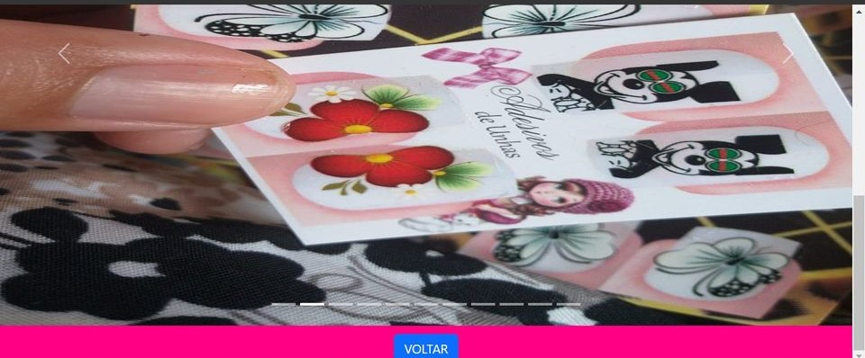
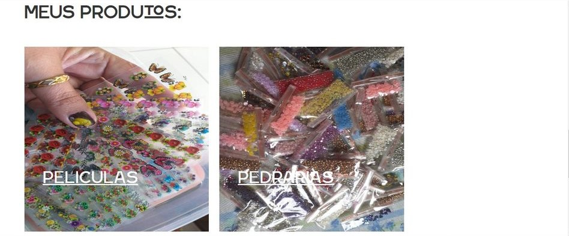

# SITE TOQUE MAGICO
👨‍⚖️TOQUE MAGICO É UM SITE QUE RODA NO GITHUB PAGES.

  
  
  
  

## DESCRIÇÃO:
O site "TOQUE MÁGICO" é uma plataforma de apresentação e vendas dos produtos de Valcilda Martins das Neves, uma empreendedora especializada em acessórios exclusivos para adesivos de unhas. O site possui os seguintes recursos:

1. **Menu de Header**: Um menu de navegação no topo da página com links para várias seções importantes, incluindo "Crie o Seu", "Ver Preços", "Mais Fotos" e "Contato".
2. **Página de Slides**: Uma página dedicada a uma galeria de slides com as 10 melhores fotos, utilizando o framework Bootstrap para um layout responsivo e elegante.
3. **Página de Tabelas Responsivas**: As tabelas de preços foram movidas para uma página específica e agora são responsivas, garantindo melhor visualização em dispositivos móveis.
4. **Página de Portfólio**: Uma seção similar à página inicial, mas com um design renovado, onde são apresentados os principais produtos como películas, adesivos e pedrarias, com descrições, preços e links para compra via WhatsApp.

O site também inclui:
- Uma descrição detalhada sobre a empreendedora, sua paixão e seus produtos.
- Imagens de alta qualidade dos produtos oferecidos.
- Links diretos para as redes sociais e contato via WhatsApp, facilitando a comunicação e o engajamento com os clientes.

O design é responsivo e atrativo, utilizando elementos visuais como imagens e botões de chamada para ação, que tornam a navegação intuitiva e agradável para os visitantes.

## MAIS:
* [CLIQUE AQUI PARA ACESSAR AO SITE](https://valcilda.github.io/TOQUE-MAGICO/index.html)
* [CLIQUE AQUI PARA ACESSAR AO REPOSITÓRIO](https://github.com/valcilda/TOQUE-MAGICO)
* [SITE CRIADO PELO VILHALVA](https://github.com/VILHALVA)
* [CRIE O SEU SITE](https://vilhalva.github.io/STYLER/03_HOME/FREELANCER/index.html)
